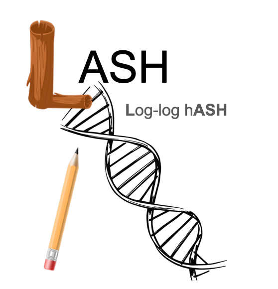

[](https://crates.io/crates/lash-rs)

# Fast and Memory Efficient Genome/Metagenome Sketching via HyperMinHash, HyperLogLog, and UltraLogLog

This is a software for genome sketching and distance approximation in LogLog space. Thus, it is named LASH (**L**oglog h**ASH**)

<div align="center">
  
</div>

### Description ###
Genome sketching can be extremely accurate but requires a huge amount of memory for MinHash-like algorithms. Recently, a new algorithm combining MinHash and HyperLogLog, called HyerMinHash was invented (1), which can perform MinHash in loglog space, a significant decrease in space/memory requirement. Together with [lukaslueg](https://github.com/lukaslueg), we first created a Rust library [hyperminhash](https://github.com/lukaslueg/hyperminhash) and then combined rolling hashing with HyperMinHash for extremely fast processing of genomic sequences. 

We also included the HyperLogLog algorithm (2), implemented  from the library [streaming_algorithms](https://github.com/jianshu93/streaming_algorithms/tree/master). HyperLogLog is more space efficient than HyperMinHash, though not as space efficient as UltraLogLog (3). Both use hashing algorithms that transform elements into a binary number, where the number of leading 0s is kept track of to estimate cardinality. UltraLogLog can be up to 28% more space efficient than HyperLogLog due to a better sketch structure and estimator. It also has better compaction when using compressing algorithms (e.g., zstd). Ultraloglog was implemented with [waynexia](https://github.com/waynexia), see [ultraloglog](https://github.com/waynexia/ultraloglog). 

We employed a simple producer-consumer model to also reduce memory requirement for large files, e.g., metagenomic files. Both sketching and distance computation are parallelized to make full use of all CPU threads/cores. Xxhash3 was used as the underlying hashing technique. 

There are two main subcommands, sketch and dist. Sketch is the sketching command and outputs 3 files; one file containing the sketches of the genomes (zstd compressed), one file containing the genome files used, and one file containing parameters used for the command. Dist is the command that "reads" the sketch files and outputs a file containing the distances between the query and reference genomes, which is specified by the user. More details on these commands are under "Usage". 

We hope that you find this tool helpful in your scientific endeavors!

## Quick install
```bash
### pre-compiled binary for Linux
wget https://github.com/jianshu93/lash/releases/download/v0.1.2/lash_Linux_x86-64_v0.1.2.zip
unzip lash_Linux_x86-64_v0.1.2.zip
chomd a+x ./lash
./lash -h

### Install from cargo, install cargo first here: https://rustup.rs, cargo will be installed by default
cargo install lash-rs

### compiling from source
git clone https://github.com/jianshu93/lash
cd lash
cargo build --release
./target/release/lash -h

```

## Usage
```bash

 ************** initializing logger *****************

Fast and Memory Efficient Genome Sketching via HyperMinHash and UltraLogLog

Usage: lash sketch [OPTIONS] --file <file>

Options:
  -f, --file <file>            One file containing list of FASTA/FASTQ files (.gz/.bz2/.zstd supported), one per line. File must be UTF-8.
  -o, --output <output>        Input a prefix/name for your output files [default: sketch]
  -k, --kmer <kmer_length>     Length of the kmer [default: 16]
  -t, --threads <threads>      Number of threads to use [default: 1]
  -a, --algorithm <algorithm>  Which algorithm to use: HyperMinHash (hmh), UltraLogLog (ull), or HyperLogLog (hll) [default: hmh]
  -p, --precision <precision>  Specifiy precision, for ull and hll only. [default: 10]
  -s, --seed <seed>            Specifiy random seed [default: 42]
  -h, --help                   Print help


Usage: lash dist [OPTIONS] --query <query> --reference <reference>

Options:
  -q, --query <query>              Prefix to search for query genome files
  -r, --reference <reference>      Prefix to search for reference genome files
  -o, --output_file <output_file>  Name of output file to write results [default: dist.txt]
  -t, --threads <threads>          Number of threads to use [default: 1]
  -e, --estimator <estimator>      Specify estimator (fgra or ml), for ull only [default: fgra]
  -h, --help                       Print help
```

```bash
ls ./data/*.fasta > query_list_strep.txt
ls ./data/*.fasta > ref_list_strep.txt
lash sketch --query_file ./query_list_strep.txt -r ref_list_strep.txt -k 16 -o skh
lash dist -q ./skh -r ./skh -t 8 -o dist

```

## Output

Output format is the same with Mash, first column query, second column reference name， third column Mash distance

## References
1. Yu YW, Weber GM. Hyperminhash: Minhash in loglog space. IEEE Transactions on Knowledge and Data Engineering. 2020 Mar 17;34(1):328-39.
2. Flajolet P, Fusy É, Gandouet O, Meunier F. HyperLogLog: the analysis of a near-optimal cardinality estimation algorithm. Discrete Mathematics & Theoretical Computer Science, Proceedings of the 2007 Conference on Analysis of Algorithms (AofA 07). 2007;AH:127–46.
3. Ertl O. UltraLogLog: A Practical and More Space-Efficient Alternative to HyperLogLog for Approximate Distinct Counting. Proceedings of the VLDB Endowment. 2024 March 1;17(7):1655-1668. 
